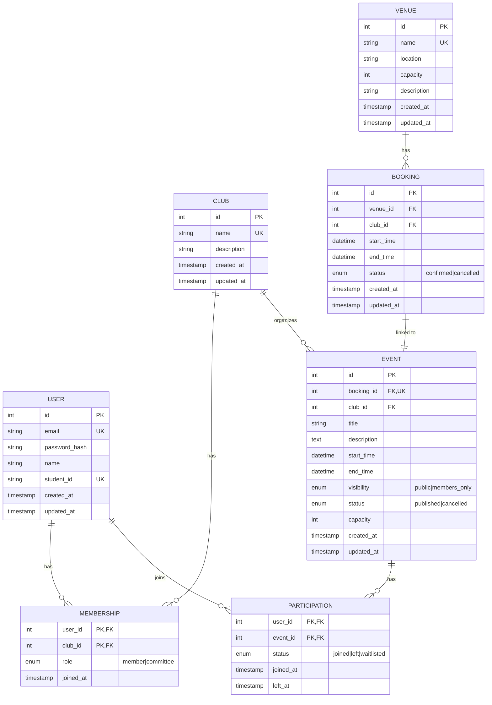

# ClubSpace Architecture

## 1. Entity-Relationship Diagram

```mermaid
erDiagram
    USER ||--o{ MEMBERSHIP : "has"
    CLUB ||--o{ MEMBERSHIP : "has"
    CLUB ||--o{ EVENT : "organizes"
    VENUE ||--o{ BOOKING : "has"
    BOOKING ||--|| EVENT : "linked to"
    USER ||--o{ PARTICIPATION : "joins"
    EVENT ||--o{ PARTICIPATION : "has"

    USER {
        int id PK
        string email UK
        string password_hash
        string name
        string student_id UK
        timestamp created_at
        timestamp updated_at
    }

    CLUB {
        int id PK
        string name UK
        string description
        timestamp created_at
        timestamp updated_at
    }

    MEMBERSHIP {
        int user_id PK,FK
        int club_id PK,FK
        enum role "member|committee"
        timestamp joined_at
    }

    VENUE {
        int id PK
        string name UK
        string location
        int capacity
        string description
        timestamp created_at
        timestamp updated_at
    }

    BOOKING {
        int id PK
        int venue_id FK
        int club_id FK
        datetime start_time
        datetime end_time
        enum status "confirmed|cancelled"
        timestamp created_at
        timestamp updated_at
    }

    EVENT {
        int id PK
        int booking_id FK,UK
        int club_id FK
        string title
        text description
        datetime start_time
        datetime end_time
        enum visibility "public|members_only"
        enum status "published|cancelled"
        int capacity
        timestamp created_at
        timestamp updated_at
    }

    PARTICIPATION {
        int user_id PK,FK
        int event_id PK,FK
        enum status "joined|left|waitlisted"
        timestamp joined_at
        timestamp left_at
    }
```
