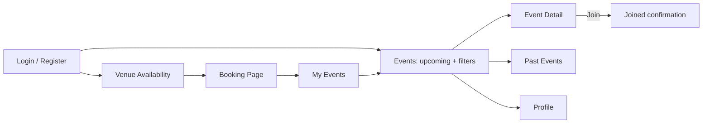

# ClubSpace: Venue Booking and Event Platform for University Clubs

## 1. Team Members

| Full Name              | Student Number |
| ---------------------- | -------------- |
| Chan Ka Ho Charlie     | 3035927104     |
| Lucien Balthazar Neale | 3036720486     |
| Chan Ka Hei Aubrey     | 3036388381     |

## 2. Project Description

ClubSpace is a web platform where university clubs book rooms and host events, and where students discover and join them. Club committees can see which venues are free, reserve a timeslot without clashing with other clubs, and publish an event as either **public** (open to everyone) or **members-only**. Students can browse upcoming and past events, filter them by date, club and type, and join the ones they like. **Target users:** club committee members (event organizers) and university students.

## 3. Feature List

### Must-have

#### Accounts and clubs

- Register, log in and log out, with two roles: _organizer_ (club committee) and _student_
- Students can edit their personal details
- Students can join clubs (club membership decides who can access members-only events)

**Venues and booking (organizers)**

- View venues and their available timeslots
- Book a venue and timeslot; the system rejects double-bookings when clubs compete for the same room

**Events**

- Organizers create an event on top of a booking: title, description, date/time, venue and promotional material (e.g. poster)
- Each event is either public or members-only

**Browsing and joining (students)**

- Browse upcoming events with filters (date, club, venue, public / members-only)
- Browse past events
- Join and leave events they are eligible for; organizers can see who joined

**Quality basics**

- Client-side and server-side input validation
- Correct HTTP status codes in the REST API (200, 201, 400, 401, 403, 404, 500)

### Nice-to-have

_Only to be started after all must-have features are finished._

- Reviews on past events
- Rating system for organizers (clubs)
- Payment for event entry fees, with different prices for members and non-members
- Organizers manually approve or reject each request to join an event
- OAuth2.0 login with a Google account

## 4. Technology Stack

| Item                | Choice                                        |
| ------------------- | --------------------------------------------- |
| Frontend            | React (Single Page Application, responsive)   |
| Backend             | Node.js + Express, RESTful API                |
| Database            | MySQL                                         |
| Deployment platform | Linux virtual machine with Docker Compose     |
| Version control     | Git + GitHub (tags for Alpha, Beta and Final) |

Deployment files (Dockerfile, docker-compose.yml, README with deployment steps) will be committed to GitHub. No real secrets will be committed; we will use environment variables and a `.env.example` template.

## 5. Preliminary Task Allocation

| Member                 | Role                    | Responsibilities                                                                                                                              |
| ---------------------- | ----------------------- | --------------------------------------------------------------------------------------------------------------------------------------------- |
| Chan Ka Ho Charlie     | Frontend                | React pages (login, events + filters, event detail, venue availability, booking page, past events, profile), responsive layout, UI/UX         |
| Lucien Balthazar Neale | Backend                 | Express REST API: authentication, venue booking with conflict checking, events, membership and join endpoints, validation, status codes       |
| Chan Ka Hei Aubrey     | Database and deployment | MySQL schema (users, clubs, venues, bookings, events, participants), queries and seed data, Dockerfile, docker-compose.yml, deployment README |

Everyone also helps with testing, documentation and the presentation, and every member will commit to GitHub through commits and pull requests.

## 6. Problem and Target User Context

**Problem.** Clubs often find it hard to reserve rooms without clashing with other clubs, and to get their events noticed. Bookings and announcements are scattered across chat groups, posters and spreadsheets, so committees waste time coordinating and students miss events.

**Users.**

- **Club committees** want to see free venues, book them quickly and promote their events to more students.
- **University students** want one place to find events, join activities and meet new people.

**Why a web application.** Both user groups need the same up-to-date information from any device, and venue availability must be shared by all clubs at once to avoid double-booking. A web app needs no installation and keeps one source of truth for bookings and events.

**Similar sites for reference:** simple room-booking systems and event pages such as Eventbrite or Meetup.

## 7. High-level Workflow

### Organizer (club committee)

1. Logs in and opens the **Venue Availability** page to see free and busy timeslots.
2. Picks a venue, date and timeslot. If it is already taken, the app shows an error and asks for another slot.
3. On the **Booking Page**, confirms the booking and enters event details: title, description, date/time, venue, poster and whether the event is public or members-only.
4. After submitting, the event appears in the event list and in **My Events**, where the organizer can see who joined.

### Student

1. Registers or logs in and lands on the **Events** page (upcoming events).
2. Filters events by date, club, venue or type.
3. Opens an **Event Detail** page and clicks **Join**. The app confirms the join, or explains why it is not possible (for example, members-only event and the student is not a member).
4. Can browse **Past Events**, join clubs, and edit personal details on the **Profile** page.

### Page flow

## 8. Anticipated Learning Challenges and Self-assessment
